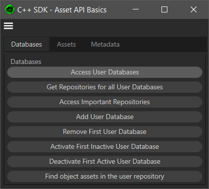

# Asset API Examples

Contains the examples for the Asset API handbook.

## Asset API Basics
Showcases basic interactions with the Asset API to modify asset databases and their content. The example is delivered as a `GeDialog` plugin with which various code snippets of the Asset API handbook can be executed.

