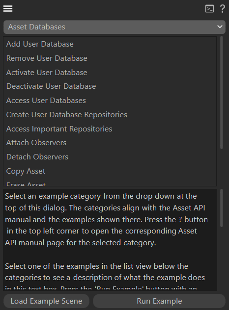

# examples.assets

Contains the examples for the Asset API Handbook.

## Asset API Examples
Showcases basic interactions with the Asset API to modify asset databases and their content. The example is delivered as a `GeDialog` plugin with which various code snippets of the Asset API Handbook can be executed. This plugin requires the SDK asset database to function correctly, you must either provide an internet connection on the machine where the plugin is being executed on or download and mount the database manually from [developers.maxon.net](https://developers.maxon.net).

See `source\asset_api_examples` for details.

*Fig I - The Asset API Examples plugin opened in the 'Asset Databases' category, containing the asset database related examples.*

## Dots Preset Asset Type Example
Implements a custom datatype with a custom GUI that can be saved as a preset asset.

Preset assets can wrap wide range of content that can be written as parameters into scene entities. Native examples for preset assets are gradient and spline preset assets.

See `source\dots_preset_asset_impl` for details.

*Fig II - A null object with a parameter that is of type `DotsData` and the Asset Browser side by side. Dots preset assets can be created and loaded with the buttons in the `DotsGui` custom GUI that complements the `DotsData` type. Assets of type `DotsPresetAsset` in the Asset Browser can be dragged into a `DotsGui` to load such asset.*

