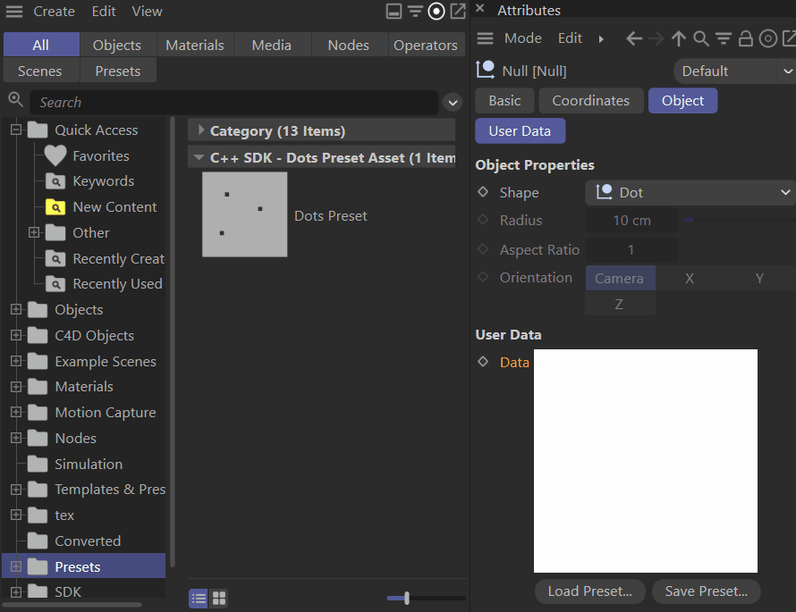

# Dots Preset Asset Type Example
Implements a custom datatype with a custom GUI that can be saved as a preset asset.

Preset assets can wrap wide range of content that can be written as parameters into scene entities. Native examples for preset assets are gradient and spline preset assets.

*Fig I - A null object with a parameter that is of type `DotsData` and the Asset Browser side by side. Dots preset assets can be created and loaded with the buttons in the `DotsGui` custom GUI that complements the `DotsData` type. Assets of type `DotsPresetAsset` in the Asset Browser can be dragged into a `DotsGui` to load such asset.*

| File | Description |
| :- | :- |
| dots_datatype.h |  Implements a custom datatype with a custom GUI that can be saved as a preset asset. |
| dots_preset_asset.h | Implements the Dots preset asset type that is targeted by the dots data type and GUI. |
| examples_dots.h | Contains the Asset API examples related to Dots preset asset implementation. |